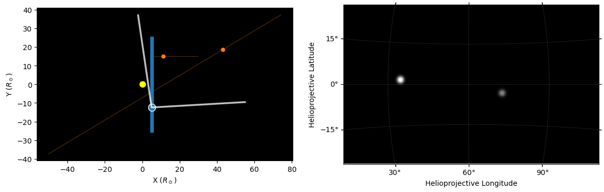
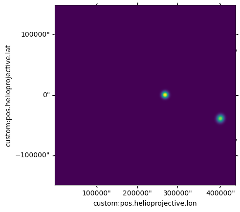

Synthesizing images
===================

The ``synthetic_data`` module allows for generating synthetic images of blobs. The blobs are assigned positions and
velocities, and images are produced from a set observer and field of view.

Objects
-------

Objects in the simulation (both the observer and the plasma blobs) are represented by one of two subclasses
of `Thing`, either `LinearThing` or `ArrayThing`. The former represents an object with constant velocity and a given
starting position, while the second represents an object with positions specified at a grid of points in time, which
is then interpolated to any specified time. ::

    from wispr_analysis.synthetic_data import *
    import astropy.units as u

    spacecraft = LinearThing(x=5*u.R_sun, z=1*u.R_sun,
                             vy=200*u.km/u.s, # Any components not provided default to 0
                             t=10*u.day # time at which the above position is valid
                            )
    parcel_t = np.linspace(9*u.day, 11*u.day)
    parcel_y = 15 * u.R_sun
    # This is a simple example, but a realistic use case would involve non-constant velocities
    parcel_x = (parcel_t - 9*u.day) * 100 * u.km/u.s + 5*u.R_sun
    parcel = ArrayThing(parcel_t, parcel_x, parcel_y)

    parcel2 = LinearThing(x=12*u.R_sun, z=-3*u.R_sun, vy=-300*u.km/u.s, vx=-500*u.km/u.s, t=10*u.day)

Synthesizing
------------

These objects can be combined in a `SimulationData`, along with a list of times (which need not match any lists of
times provided to any `ArrayThing` ). `SimulationData` provides a function to plot an overhead view of the setup, and
the list of times is used for plotting the observer's position over time. Many of the plotting defaults work best for
PSP-like situations---a viewpoint a few tens of solar radii from the Sun. ::

    simdat = SimulationData(sc=spacecraft,
                            parcels=[parcel, parcel2],
                            t=np.linspace(9*u.day, 11*u.day, 100) # Point in time at which to draw and synthesize
                           )
    simdat.plot_and_synthesize(9.5*u.day, mark_FOV=True, focus_sc=False)

    The image generated by `SimulationData.plot_and_synthesize`. The left panel shows an overhead view, with blue marking the
    viewpoint (the spacecraft) and its trajectory, and orange parking the parcels and their trajectories. White lines
    mark the bounds of the field of view. On the right is a synthesized images for this setup at the given time.

`synthetic_data` contains a set of utility functions such as `add_random_parcels` to add many parcels at once to a
`SimulationData`.

Images can be synthesized directly with `synthesize_image`, which returns the synthesized image. ::

    image, wcs = synthesize_image(simdat.sc, simdat.parcels, 9.8*u.day)
    plt.subplot(111, projection=wcs)
    plt.imshow(np.sqrt(image))

The field of view of the camera is, by default, a realistic WISPR-like field in size and pointing relative to the Sun
. The field of view can be customized by creating a ``WCS`` object (e.g. in helioprojective coordinates) and passing
it in to `synthesize_image` or `SimulationData.plot_and_synthesize`.